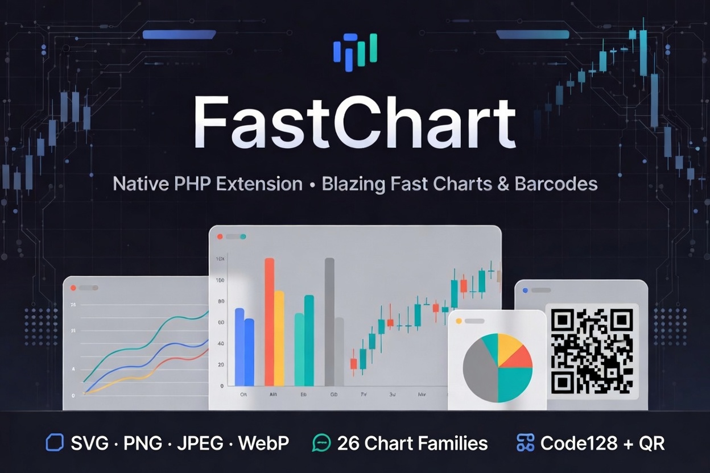

# fastchart

[](https://github.com/iliaal/fastchart/actions/workflows/tests.yml)
[](https://github.com/iliaal/fastchart/releases)
[](https://opensource.org/licenses/BSD-3-Clause)
[](https://x.com/intent/follow?screen_name=iliaa)

Native C PHP extension. 19 chart types behind a modern OO API with
fluent setters and `final` classes. Line, area, bar, scatter, bubble,
pie, radar, polar, surface, contour, gauge, gantt, box-plot, treemap,
funnel, waterfall, heatmap, linear meter, plus a deep `StockChart`
(seven candle styles, SMA / EMA / WMA overlays, volume + indicator
panes).

SVG is the canonical render format. PNG / JPG / WebP outputs flatten
text to glyph paths, run plutovg over the resulting SVG, and encode
the RGBA buffer with libpng / libjpeg-turbo / libwebp. The same chart
object serves a sharp `<svg>` for dashboards or a PNG for emails
without rebuilding state. `renderToFile()` picks the encoder from the
extension; `renderPng()` / `renderJpeg()` / `renderWebp()` /
`renderSvg()` return bytes in-process.



## Status

v1.0: rebuilt around plutovg, libgd dropped as a runtime dependency,
`draw($canvas)` replaced by SVG + raster shortcuts. 19 chart types,
2-class Symbol family, 84 phpt tests passing, raster and SVG output
for every type. See [`CHANGELOG.md`](CHANGELOG.md) for the full
breaking-change list.

## Install

### Via PIE (recommended)

[PIE](https://github.com/php/pie) handles the configure / make /
install cycle for you against your active PHP install:

```sh
pie install iliaal/fastchart
```

PIE picks up the latest tagged release from Packagist and respects
your platform's `pkg-config` for the FreeType / libpng /
libjpeg-turbo / libwebp probes. After install, enable the
extension via your distribution's mechanism (e.g.
`docker-php-ext-enable fastchart` on the official PHP images, or
add `extension=fastchart` to `php.ini`).

### From source

Build manually against the PHP install you want to extend:

```sh
phpize
./configure --enable-fastchart
make -j
make test
```

Strict-warnings dev build (recommended for contributors):

```sh
./configure --enable-fastchart --enable-fastchart-dev
```

Runtime check:

```sh
php -d extension=./modules/fastchart.so \
  -r 'echo FastChart\Chart::version(), PHP_EOL;'
```

## Requirements

- PHP 8.3 or later (NTS or ZTS).
- **FreeType** development headers (`libfreetype-dev` /
  `freetype-devel`). Required — text rendering depends on FreeType.
- **libpng / libjpeg-turbo / libwebp** development headers. Each is
  optional; config.m4 probes them independently via pkg-config and
  the corresponding `renderPng()` / `renderJpeg()` / `renderWebp()`
  is wired up only for libs that resolve at build time. A missing
  lib turns the matching method into a "format not compiled in"
  Error at call time; SVG output stays available regardless.
  `phpinfo()` reports the resolved version of each lib (or `(not
  compiled in)`) so you can audit a build.
- plutovg + plutosvg are vendored under `vendor/`; no separate install
  required.

## Quick start

The shortest path is the `renderToFile()` helper, which picks the
encoder from the file extension:

```php
(new FastChart\LineChart(640, 320))
    ->setTitle('Daily active users')
    ->setSeries([['data' => [820, 940, 870, 1020, 1180, 1250, 1340]]])
    ->setCategoryLabels(['Mon','Tue','Wed','Thu','Fri','Sat','Sun'])
    ->renderToFile('/tmp/dau.png');
```

`renderPng()`, `renderJpeg()`, and `renderWebp()` return the encoded
bytes if you need them in memory. `setJpegQuality(int)` tunes the
JPEG encoder (1..100, default 88).

For vector output — dashboards, print, anywhere infinite-zoom matters
— call `renderSvg()` on the same chart object:

```php
$chart = (new FastChart\LineChart(640, 320))
    ->setTitle('Daily active users')
    ->setSeries([['data' => [820, 940, 870, 1020, 1180, 1250, 1340]]])
    ->setCategoryLabels(['Mon','Tue','Wed','Thu','Fri','Sat','Sun']);

$svg = $chart->renderSvg();              // full <?xml ?><svg>...</svg>
$chart->renderToFile('/tmp/dau.svg');    // same, written to disk

// Stitch several charts into one outer SVG document:
$fragment = $chart->drawSvgFragment();   // <g class="fastchart">...</g>
```

Construction is identical for every output format; only the final
render call differs. By default, SVG text is flattened to glyph
outline paths (`SVG_TEXT_PATHS` mode) — the resulting SVG is fully
self-contained and renders identically in any viewer or rasterizer.
For smaller files with selectable text, switch to native `<text>`
mode:

```php
$chart->setSvgTextMode(FastChart\Chart::SVG_TEXT_NATIVE);
$svg = $chart->renderSvg();  // ~30% smaller; needs consumer text support
```

Raster outputs (PNG/JPG/WebP) always use the PATHS mode internally —
plutovg has no text support of its own, so glyph flattening is what
makes labels appear in the rasterized output.

## 📊 Performance

Median in-memory render time at 1920×1080 on a single core (Intel
i9-13950HX, PHP 8.4 debug build, default font + DPI). SVG is the
canonical output; PNG / WebP / JPG go through the same SVG build,
then plutosvg + plutovg rasterize, then the format encoder
(libpng / libwebp / libjpeg-turbo). The raster columns therefore
add the rasterize cost on top of the SVG-only number.

| Chart        | SVG ms | PNG ms | WebP ms | JPG ms |
|--------------|-------:|-------:|--------:|-------:|
| AreaChart    |    8.2 |   79.5 |   112.1 |   34.8 |
| BarChart     |   13.4 |   75.6 |   109.2 |   40.3 |
| BoxPlot      |    5.2 |   65.5 |   101.2 |   31.5 |
| BubbleChart  |    3.0 |   85.0 |   118.3 |   39.8 |
| ContourChart |    3.1 |   79.5 |   118.3 |   35.7 |
| Funnel       |    5.1 |   63.2 |   102.1 |   29.5 |
| GanttChart   |    6.8 |   66.7 |    99.2 |   31.6 |
| GaugeChart   |    1.6 |   69.8 |   101.8 |   28.8 |
| Heatmap      |    1.9 |   63.7 |   100.1 |   32.8 |
| LineChart    |    6.4 |   75.6 |   119.5 |   36.5 |
| LinearMeter  |    1.6 |   65.8 |    90.1 |   24.8 |
| PieChart     |    3.6 |   72.6 |   105.0 |   32.9 |
| PolarChart   |    1.4 |   72.4 |   106.5 |   31.7 |
| RadarChart   |    4.0 |   76.2 |   110.8 |   35.9 |
| ScatterChart |    5.8 |   70.7 |    99.7 |   33.2 |
| StockChart   |    9.8 |   81.6 |   121.3 |   41.3 |
| SurfaceChart |    2.5 |   62.6 |   100.3 |   28.8 |
| Treemap      |    6.1 |   67.2 |   105.2 |   30.7 |
| Waterfall    |    5.9 |   65.9 |   104.0 |   31.5 |

SVG is in the single-digit-ms range across the board because there's
no rasterization — the backend appends strings into a `smart_str`.
PNG and JPG land in the 60–85 ms band; WebP is the slowest encoder
(libwebp's encoder costs more than libpng / libjpeg-turbo for our
typical chart-shaped images). All four formats stay under 125 ms
at 1080p on one thread.

Repro the numbers locally:

```sh
php -d extension=./modules/fastchart.so docs/bench/bench.php
```

Iteration count via `FC_BENCH_ITERS` (default 50). Bench source at
[`docs/bench/bench.php`](docs/bench/bench.php).

## What you can render

19 chart classes plus a 2-class symbology family, all under the
`FastChart\` namespace. Each name links to its rendered example image:

- **Cartesian:** [`LineChart`](docs/examples/01_line_basic.png),
  [`AreaChart`](docs/examples/27a_area_stacked.png),
  [`BarChart`](docs/examples/03_bar_grouped.png) (vertical, horizontal,
  stacked, grouped, floating, layered),
  [`ScatterChart`](docs/examples/06_scatter_trend.png),
  [`BubbleChart`](docs/examples/14_bubble.png).
- **Financial:** [`StockChart`](docs/examples/07_stock_candle_ma.png)
  with seven candle styles (`STYLE_CANDLE`, `STYLE_BAR`,
  `STYLE_DIAMOND`, `STYLE_I_CAP`, `STYLE_HOLLOW`, `STYLE_VOLUME`,
  `STYLE_VECTOR`), SMA / EMA / WMA overlays, optional volume pane and
  custom indicator panes (RSI, MACD, Bollinger, OBV, stochastic, PSAR).
- **Non-Cartesian:** [`RadarChart`](docs/examples/08_radar.png),
  [`PolarChart`](docs/examples/16_polar.png),
  [`SurfaceChart`](docs/examples/15a_surface.png),
  [`ContourChart`](docs/examples/15b_contour.png).
- **Specialised:** [`PieChart`](docs/examples/05_pie_donut.png) (with
  optional donut hole + leader lines),
  [`GaugeChart`](docs/examples/10_gauge.png),
  [`LinearMeter`](docs/examples/36a_linear_meter_horizontal.png),
  [`GanttChart`](docs/examples/17_gantt.png),
  [`BoxPlot`](docs/examples/09_boxplot.png),
  [`Treemap`](docs/examples/32_treemap.png),
  [`Funnel`](docs/examples/33_funnel.png),
  [`Waterfall`](docs/examples/34_waterfall.png),
  [`Heatmap`](docs/examples/35_heatmap.png).
- **Symbology:** [`Code128`](docs/examples/41a_code128_alphanumeric.png)
  (1D barcode, ISO/IEC 15417, auto-switching A/B/C subsets, optional
  human-readable text), [`QrCode`](docs/examples/42b_qrcode_ecc_m.png)
  (2D matrix code, ISO/IEC 18004, ECC L/M/Q/H, versions 1..40).

Cross-cutting features available on most chart types:

- TrueType / OpenType labels via `setFontPath()` (and per-role
  `setTitleFont()`, `setAxisFont()`, `setLabelFont()`).
- Light and dark themes (`THEME_LIGHT`, `THEME_DARK`); per-series colors
  via `setSeriesColors()`; full custom palettes via `setPalette()`.
- Legend positioning (`LEGEND_TOP_RIGHT`, `_TOP_LEFT`, `_BOTTOM_RIGHT`,
  `_BOTTOM_LEFT`, `_NONE`).
- Annotations: plot bands, vertical bands, horizontal / vertical lines,
  text labels, icon plots, error bars, zones.
- Strict-mode input validation (`setStrict(true)` rejects malformed
  series with a `TypeError` instead of silently coercing to NaN).
- Background images, drop shadows, anti-aliased lines and markers.
- Image map output (`getImageMap()` returns category-aligned
  rectangles for HTML overlay).

## Examples

A gallery of code + rendered chart pairs lives in
[`docs/README.md`](docs/README.md). Forty-two runnable scripts in
[`docs/examples/`](docs/examples/) regenerate the images and exercise
every public method on the API surface.

## Public classes

All under the `FastChart\` namespace:

- `Chart`: abstract base. Carries shared geometry / theme / font /
  legend / annotation setters, the `version()` static, and the chart-
  family enums (themes, candle styles, legend positions, line styles,
  marker styles, MA kinds).
- `LineChart`, `AreaChart`, `BarChart`, `ScatterChart`,
  `BubbleChart`: series-based plots.
- `PieChart`: slice-based, with optional donut hole.
- `StockChart`: OHLC(V) candlesticks, moving-average overlays,
  volume + indicator panes.
- `RadarChart`, `PolarChart`, `SurfaceChart`,
  `ContourChart`: non-Cartesian plots.
- `GaugeChart`, `LinearMeter`: single-value readouts with zoned ranges.
- `GanttChart`: time-axis task bars with dependency links and
  milestones.
- `BoxPlot`: five-number summaries with per-category outliers.
- `Treemap`, `Funnel`, `Waterfall`: value-encoded layouts (rectangle
  packing, stage drop-off, signed-delta running totals).
- `Heatmap`: 2D grid with linear color-ramp interpolation.

Every setter returns `static`, so a single fluent expression configures
and emits a chart.

The Symbol family lives parallel to `Chart` (no shared base — axes /
palettes / plot rect have no meaning for a barcode):

- `Symbol`: abstract base for all 1D + 2D codes. Carries shared
  setters: `setSize()`, `setData()`, `setQuietZone()`, `setForeground()`,
  `setBackground()`, `setTransparentBackground()`, `setDpi()`,
  `setSvgTextMode()`, `setJpegQuality()`, plus the same `renderPng()`
  / `renderJpeg()` / `renderWebp()` / `renderSvg()` /
  `drawSvgFragment()` / `renderToFile()` helpers as `Chart`. Reload
  via `imagecreatefromstring()` to composite onto an existing canvas.
- `Barcode`: abstract 1D linear-barcode base.
- `Code128` (extends `Barcode`): ISO/IEC 15417, alphanumeric, three
  subsets (A: control + uppercase, B: full ASCII printable, C: digit
  pairs). Auto-switches between subsets to minimise encoded length;
  mod-103 checksum appended automatically. `setShowText(true)`
  renders the human-readable payload below the bars using the
  auto-detected default font.
- `QrCode` (extends `Symbol`): ISO/IEC 18004, four error-correction
  levels (`ECC_L` ~7%, `ECC_M` ~15%, `ECC_Q` ~25%, `ECC_H` ~30%),
  versions 1..40. Encoder is the vendored nayuki/QR-Code-generator
  C library. `setMinVersion()` / `setMaxVersion()` pin the symbol
  size; the encoder picks the smallest version that fits within the
  range. Input must be valid UTF-8.

## 🔗 PHP Performance Toolkit

Companion native PHP extensions for high-throughput PHP workloads:

- **[php_excel](https://github.com/iliaal/php_excel)**: native Excel I/O. 7-10× faster than PhpSpreadsheet, full XLS/XLSX with formulas, formatting, and styling. Powered by LibXL.
- **[mdparser](https://github.com/iliaal/mdparser)**: native CommonMark + GFM parser. 15-30× faster than pure-PHP alternatives, full CommonMark 0.31 compliance.
- **[php_clickhouse](https://github.com/iliaal/php_clickhouse)**: native ClickHouse client speaking the wire protocol directly. Picks up where SeasClick left off.

## License

BSD 3-Clause for the extension itself; see [`LICENSE`](LICENSE).
Vendored third-party code (all MIT):

- `vendor/plutovg/` — Samuel Ugochukwu's
  [plutovg](https://github.com/sammycage/plutovg) 2D rasterizer.
  See [`vendor/plutovg/LICENSE`](vendor/plutovg/LICENSE).
- `vendor/plutosvg/` — Samuel Ugochukwu's
  [plutosvg](https://github.com/sammycage/plutosvg) SVG document
  parser. See [`vendor/plutosvg/LICENSE`](vendor/plutosvg/LICENSE).
- `vendor/qrcodegen/` — nayuki's
  [QR-Code-generator](https://github.com/nayuki/QR-Code-generator)
  (C variant). See [`vendor/qrcodegen/LICENSE`](vendor/qrcodegen/LICENSE).

SPDX: `(BSD-3-Clause AND MIT)`.

---

[Follow @iliaa on X](https://x.com/iliaa) • [Blog](https://ilia.ws) • If this saved you a chart-rendering microservice, ⭐ star it!
