# fastchart examples

Each example below is a self-contained PHP script that renders the
chart shown beside it. The scripts are runnable as-is with `fastchart`
loaded; ext/gd is no longer required at runtime:

```bash
php -d extension=fastchart docs/examples/01_line_basic.php
```

Together the 40 scripts exercise every public method on the
`FastChart\*` classes (105/105 covered), so this gallery doubles as
live documentation: if a knob exists, an example demonstrates it.

Every script `require`s `_bootstrap.php` to resolve a TrueType font
path (DejaVu on common Linux distros, Helvetica on macOS) into a
`$font` variable, and each chart calls `->setFontPath($font)` so the
output is anti-aliased and portable across systems. Override with
`FC_FONT=/path/to/Custom.ttf` if your fonts live elsewhere.

The PNGs are generated by running the scripts; modifying a script and
re-running it refreshes the corresponding image.

---

## 1. Line: basic

A minimal line chart: one series, auto-scaled axes, category labels
along X. `renderToFile` infers the format from the file extension.

```php
(new FastChart\LineChart(640, 320))
    ->setTitle('Daily active users')
    ->setSeries([['data' => [820, 940, 870, 1020, 1180, 1250, 1340]]])
    ->setCategoryLabels(['Mon', 'Tue', 'Wed', 'Thu', 'Fri', 'Sat', 'Sun'])
    ->renderToFile('01_line_basic.png');
```

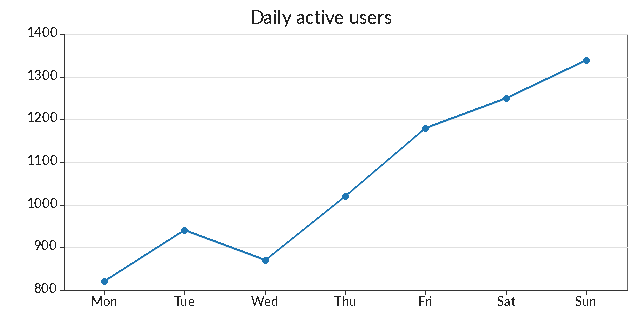

---

## 2. Line: multi-series + smoothing

Three named series, axis titles, Catmull-Rom smoothing, circle markers,
top-left legend.

```php
(new FastChart\LineChart(640, 380))
    ->setTitle('Quarterly revenue by region')
    ->setXAxisTitle('Quarter')
    ->setYAxisTitle('Revenue ($M)')
    ->setSeries([
        ['label' => 'Americas', 'data' => [42, 51, 47, 63, 71, 78, 85, 92]],
        ['label' => 'EMEA',     'data' => [28, 33, 35, 39, 45, 52, 58, 64]],
        ['label' => 'APAC',     'data' => [18, 22, 28, 34, 41, 48, 56, 67]],
    ])
    ->setCategoryLabels(['Q1\'24','Q2\'24','Q3\'24','Q4\'24',
                         'Q1\'25','Q2\'25','Q3\'25','Q4\'25'])
    ->setLineInterpolation(FastChart\Chart::INTERP_SMOOTH)
    ->setMarkerStyle(FastChart\Chart::MARKER_CIRCLE)
    ->setLegendPosition(FastChart\Chart::LEGEND_TOP_LEFT)
    ->renderToFile('02_line_multi.png');
```

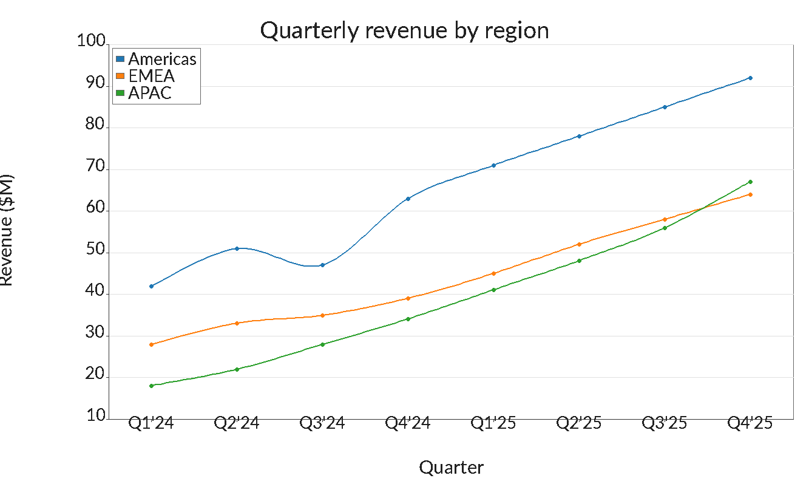

---

## 3. Bar: grouped (multi-series)

Side-by-side bars with custom palette, edge color, and per-bar value
labels.

```php
(new FastChart\BarChart(640, 380))
    ->setTitle('Monthly tickets opened vs closed')
    ->setSeries([
        ['label' => 'Opened', 'data' => [42, 38, 51, 47, 55, 49]],
        ['label' => 'Closed', 'data' => [35, 41, 48, 50, 52, 54]],
    ])
    ->setCategoryLabels(['Jan', 'Feb', 'Mar', 'Apr', 'May', 'Jun'])
    ->setSeriesColors([0xE34A6F, 0x4FB286])
    ->setShowValues(true)
    ->setEdgeColor(0x222222)
    ->renderToFile('03_bar_grouped.png');
```

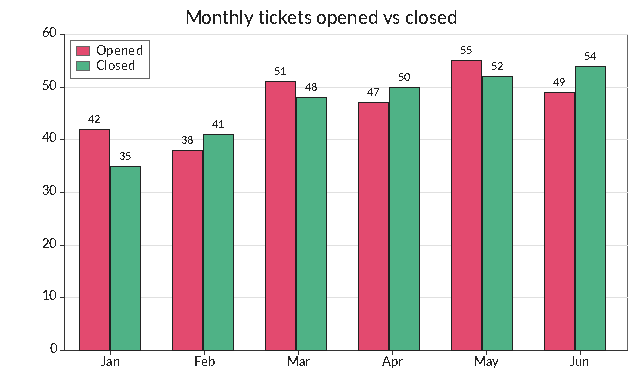

---

## 4. Bar: horizontal with value-axis bands

`setOrientation(BAR_HORIZONTAL)` swaps the axes so long category labels
fit comfortably along Y. Two `addVerticalBand` calls highlight the SLA
threshold.

```php
(new FastChart\BarChart(680, 380))
    ->setOrientation(FastChart\BarChart::BAR_HORIZONTAL)
    ->setTitle('p95 latency by endpoint (ms)')
    ->setSeries([
        ['label' => 'Read',  'data' => [120, 85, 240, 180, 95, 310, 145]],
        ['label' => 'Write', 'data' => [180, 120, 380, 290, 140, 480, 220]],
    ])
    ->setCategoryLabels(['users', 'sessions', 'reports',
                         'search', 'auth', 'exports', 'health'])
    ->setStacked(true)
    ->addVerticalBand(0, 200, 0x4FB286, 96, 'SLA')
    ->addVerticalBand(200, 500, 0xE34A6F, 96, 'over SLA')
    ->renderToFile('04_bar_horizontal.png');
```

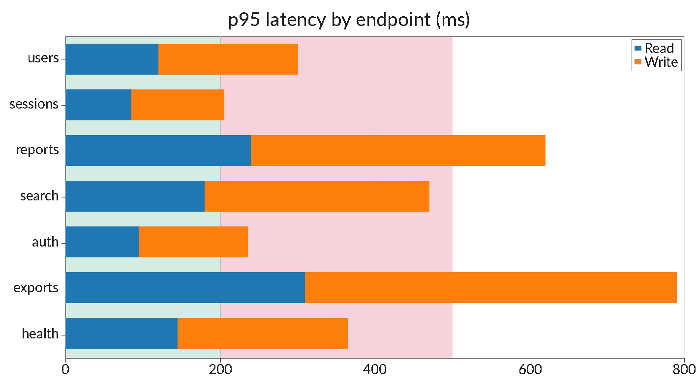

---

## 5. Pie / donut with explode

Donut hole via `setDonutHoleRatio`, one slice pulled out via
`setExplode`, percentage labels rendered outside, custom palette.

```php
(new FastChart\PieChart(560, 400))
    ->setTitle('Traffic source breakdown')
    ->setSlices([
        'Organic search' => 41, 'Direct' => 28, 'Referral' => 15,
        'Social' => 9, 'Email' => 5, 'Paid' => 2,
    ])
    ->setDonutHoleRatio(0.5)
    ->setExplode([0 => 12])
    ->setSliceLabelPosition(FastChart\Chart::LABEL_OUTSIDE)
    ->setSliceLabelFormat('%.0f%%')
    ->setSeriesColors([0x4F86C6, 0xF6AE2D, 0xE34A6F, 0x4FB286, 0x9B5DE5, 0x9D9D9D])
    ->renderToFile('05_pie_donut.png');
```

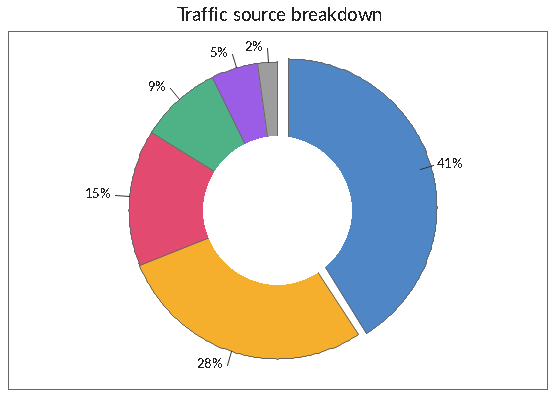

---

## 6. Scatter with polynomial trend line

Each point is `[x, y]` in data coordinates. `setTrendLine(true,
$color, $degree)` overlays a least-squares fit; degrees 1..3 are
accepted.

```php
(new FastChart\ScatterChart(640, 400))
    ->setTitle('Page load time vs payload size')
    ->setXAxisTitle('Payload (KB)')
    ->setYAxisTitle('Time (s)')
    ->setPoints($pts)
    ->setMarkerStyle(FastChart\Chart::MARKER_CIRCLE)
    ->setMarkerSize(6)
    ->setTrendLine(true, 0xE34A6F, 2)  // quadratic fit
    ->renderToFile('06_scatter_trend.png');
```

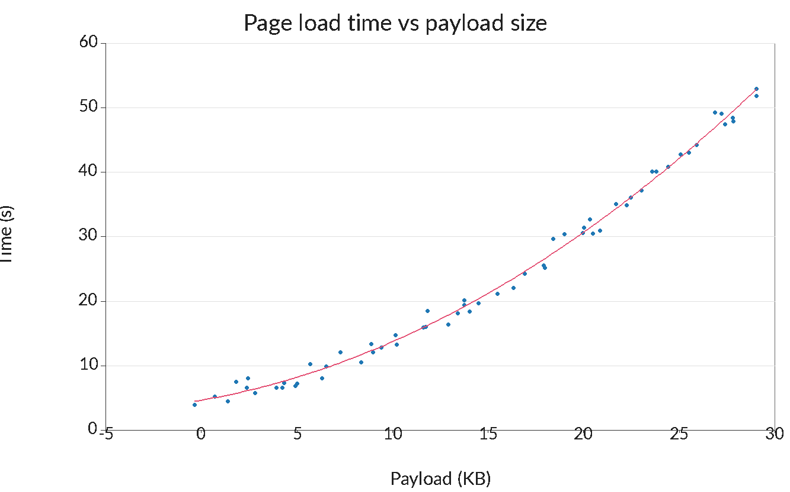

---

## 7. Stock: candlestick with MA overlays + volume

`setOhlcv` takes rows of `[timestamp, open, high, low, close, volume]`.
`addMovingAverage` accepts SMA, EMA, or WMA and any period; up to 8
overlays per chart.

```php
(new FastChart\StockChart(800, 460))
    ->setTitle('ACME 90 day OHLCV')
    ->setOhlcv($rows)
    ->addMovingAverage(10, FastChart\StockChart::MA_SMA)
    ->addMovingAverage(20, FastChart\StockChart::MA_EMA)
    ->addMovingAverage(30, FastChart\StockChart::MA_WMA)
    ->setVolumePane(true)
    ->setCandleStyle(FastChart\Chart::STYLE_CANDLE)
    ->renderToFile('07_stock_candle_ma.png');
```

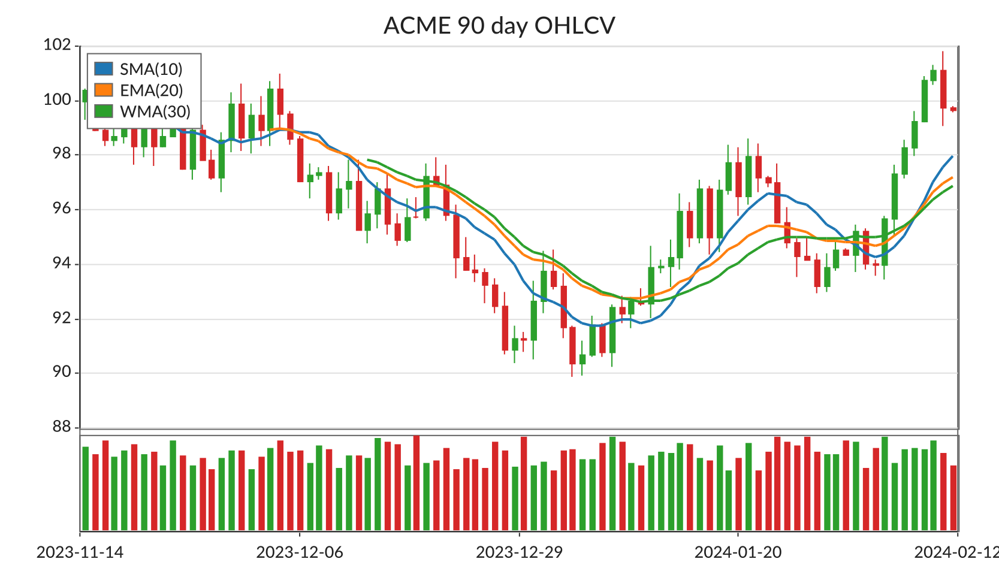

---

## 8. Radar / spider

Multi-series radar with shared axis labels via `setCategoryLabels` and
a fixed scale via `setMaxValue`.

```php
(new FastChart\RadarChart(560, 480))
    ->setTitle('Feature parity scorecard')
    ->setSeries([
        ['label' => 'Product A', 'data' => [8, 7, 9, 6, 8, 7]],
        ['label' => 'Product B', 'data' => [6, 9, 7, 8, 5, 9]],
    ])
    ->setCategoryLabels(['Speed', 'Reliability', 'API', 'Docs', 'Support', 'Pricing'])
    ->setMaxValue(10)
    ->setSeriesColors([0x4F86C6, 0xE34A6F])
    ->renderToFile('08_radar.png');
```

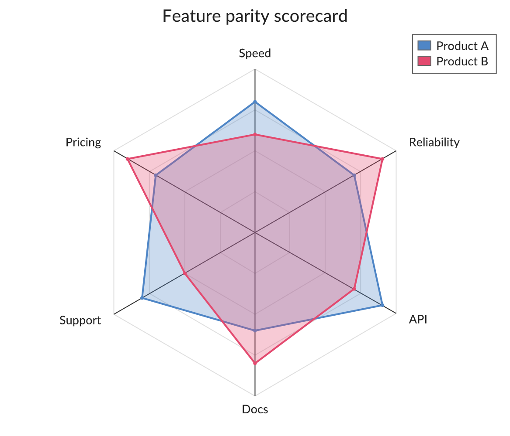

---

## 9. Box plot with outliers

Each box is `[min, q1, median, q3, max]` plus an optional `outliers`
array. Outliers render as small open circles, capped at 128 per box.

```php
(new FastChart\BoxPlot(640, 400))
    ->setTitle('Response time distribution by service')
    ->setYAxisTitle('Latency (ms)')
    ->setBoxes([
        ['label' => 'auth',    'min' => 18, 'q1' => 32, 'median' => 45,
         'q3' => 58, 'max' => 95,  'outliers' => [120, 135]],
        ['label' => 'search',  'min' => 80, 'q1' => 110, 'median' => 145,
         'q3' => 195, 'max' => 320, 'outliers' => [410, 480, 510]],
        // ...
    ])
    ->renderToFile('09_boxplot.png');
```

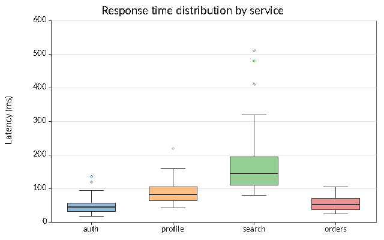

---

## 10. Gauge with zones

Half-circle gauge with three colored zones. `setZones` takes a list of
`{from, to, color}` dicts; the needle position comes from `setValue`.

```php
(new FastChart\GaugeChart(480, 320))
    ->setTitle('Server CPU utilization')
    ->setRange(0, 100)
    ->setValue(72)
    ->setZones([
        ['from' => 0,  'to' => 50,  'color' => 0x4FB286],
        ['from' => 50, 'to' => 80,  'color' => 0xF6AE2D],
        ['from' => 80, 'to' => 100, 'color' => 0xE34A6F],
    ])
    ->setValueFormat('%.0f%%')
    ->renderToFile('10_gauge.png');
```

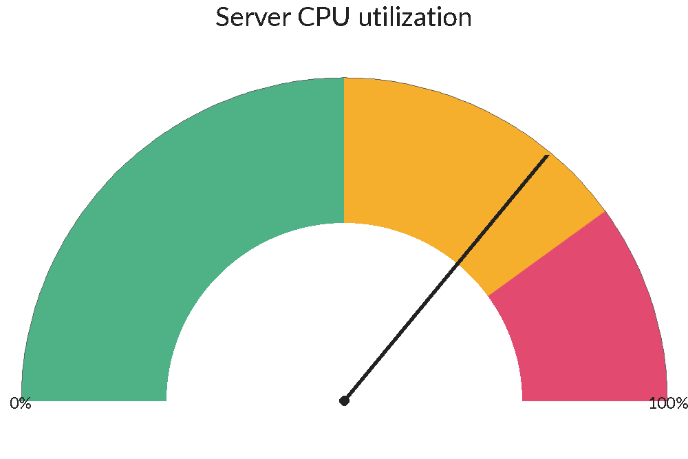

---

## 11. Plot bands + line annotations

`addHorizontalBand` shades a Y-range region; `addHorizontalLine` and
`addVerticalLine` draw dashed reference lines with optional labels.

```php
(new FastChart\LineChart(720, 380))
    ->setTitle('Conversion rate over the deploy window')
    ->setYAxisTitle('Conversion (%)')
    ->setSeries([['data' => [3.2, 3.4, 3.1, 3.3, 3.5, 4.1, 4.4, 4.2, 4.5, 4.7, 4.6, 4.8]]])
    ->setCategoryLabels(['Wk1','Wk2','Wk3','Wk4','Wk5','Wk6',
                         'Wk7','Wk8','Wk9','Wk10','Wk11','Wk12'])
    ->addHorizontalBand(4.0, 5.0, 0x4FB286, 96, 'target')
    ->addHorizontalLine(4.5, 'goal', 0xE34A6F)
    ->addVerticalLine(5.0, 'deploy', 0x4F86C6)
    ->setMarkerStyle(FastChart\Chart::MARKER_CIRCLE)
    ->renderToFile('11_plot_bands_annotations.png');
```

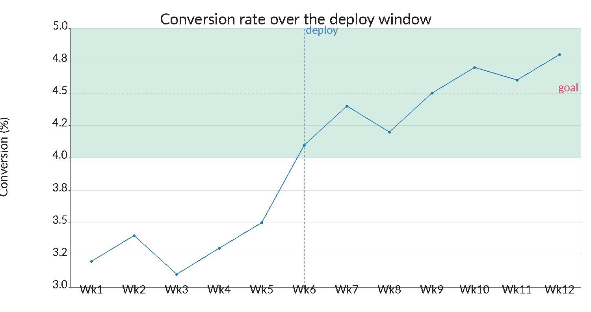

---

## 12. Themes and gradient fills

Same data, three presentations. `setTheme(THEME_LIGHT|THEME_DARK)`
swaps the palette. `setGradientFill` ramps the bar fill;
`setDropShadow` + `setShadowAlpha` adds an offset shadow on the
filled shapes.

```php
(new FastChart\BarChart(420, 260))
    ->setTitle('Gradient + shadow')->setSeries($data)->setCategoryLabels($labels)
    ->setGradientFill(0x4F86C6, 0xE34A6F, FastChart\Chart::GRADIENT_VERTICAL)
    ->setDropShadow(3, 3, 0x000000)->setShadowAlpha(80)
    ->renderToFile('12c_gradient.png');
```

| Light | Dark | Gradient + shadow |
|---|---|---|
| 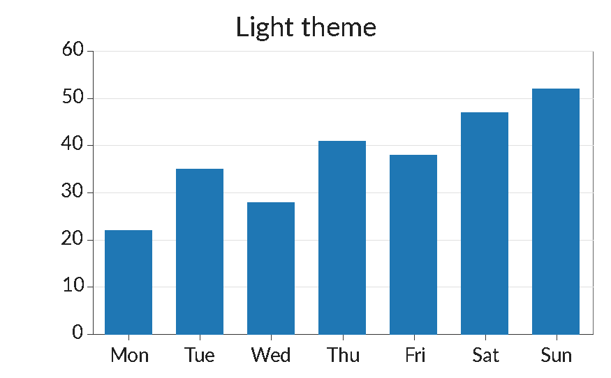 | 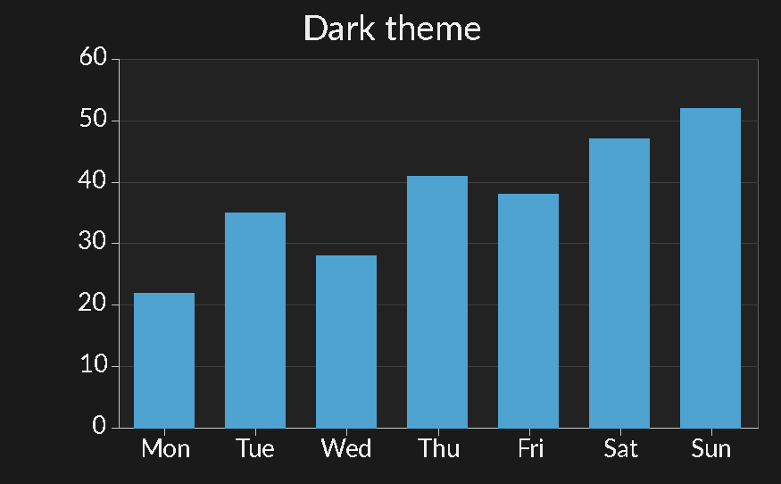 | 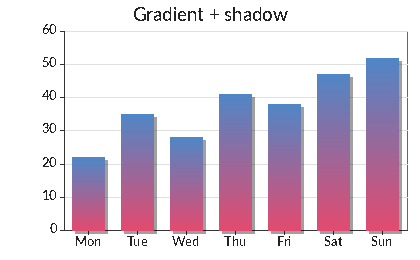 |

---

## 13. Secondary Y axis

A series joins the right axis by adding `'axis' => 'right'` to its
dict. Honored on `LineChart` (and any chart that plumbs `range_r`).

```php
(new FastChart\LineChart(720, 380))
    ->setTitle('Traffic vs revenue (independent scales)')
    ->setSecondaryYAxis(true)
    ->setSecondaryYAxisTitle('Revenue ($K)')
    ->setSeries([
        ['label' => 'Page views', 'data' => [12000, 14500, /* … */]],
        ['label' => 'Revenue', 'axis' => 'right', 'data' => [42, 48, /* … */]],
    ])
    ->renderToFile('13_secondary_axis.png');
```

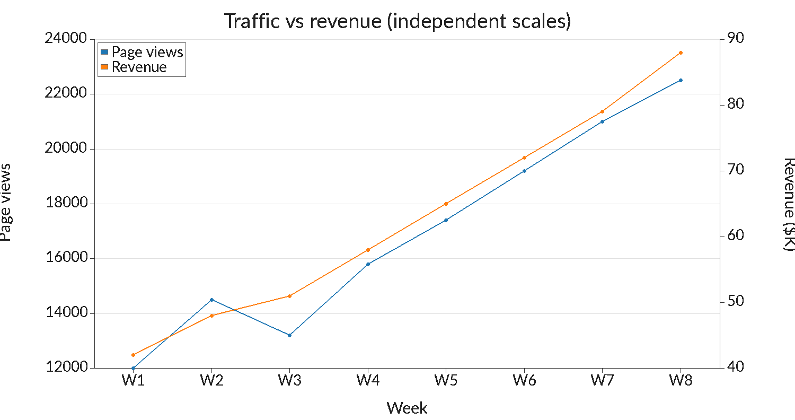

---

## 14. Bubble chart

Each point is `[x, y, size]`. Bubble area scales with the third
dimension so visual weight matches magnitude.

```php
(new FastChart\BubbleChart(640, 400))
    ->setTitle('Project size vs delivery risk')
    ->setPoints([
        [8, 2.5, 5], [13, 1.8, 8], [21, 3.2, 12], [34, 5.5, 18],
        [55, 7.2, 25], [89, 8.9, 40], /* … */
    ])
    ->renderToFile('14_bubble.png');
```

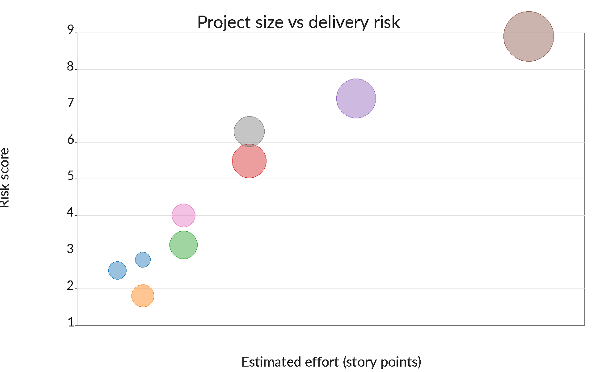

---

## 15. Surface heatmap and contour

Same row-major grid rendered as a heatmap (SurfaceChart) and as iso-
contours at user-supplied levels (ContourChart). `setColorRamp` takes
`[low_rgb, high_rgb]` and interpolates linearly.

```php
(new FastChart\SurfaceChart(560, 320))
    ->setTitle('Surface heatmap')
    ->setGrid($grid)
    ->setColorRamp(0x1F4E79, 0xE34A6F)
    ->renderToFile('15a_surface.png');

(new FastChart\ContourChart(560, 320))
    ->setTitle('Filled contour at 7 levels')
    ->setGrid($grid)
    ->setLevels([-8, -4, -2, 0, 2, 4, 8])
    ->setFilled(true)
    ->setColorRamp(0x1F4E79, 0xE34A6F)
    ->renderToFile('15b_contour.png');
```

| Surface | Contour |
|---|---|
| 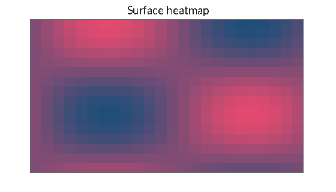 | 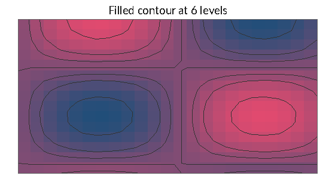 |

---

## 16. Polar chart

Each point is `[angle_deg, radius]`. Multi-series with up to 8 traces.

```php
(new FastChart\PolarChart(520, 520))
    ->setTitle('Antenna gain pattern')
    ->setSeries([
        ['label' => 'Antenna A', 'data' => $pts_a],
        ['label' => 'Antenna B', 'data' => $pts_b],
    ])
    ->setMaxRadius(8)
    ->renderToFile('16_polar.png');
```

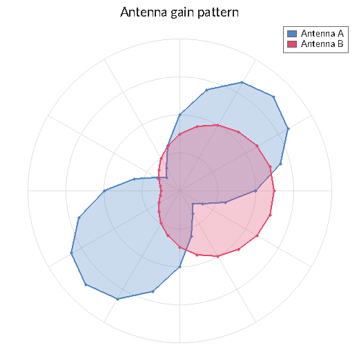

---

## 17. Gantt timeline

Tasks with `[name, start, end, depends?, milestone?]` shapes.
Milestones render as diamonds at a single point.

```php
(new FastChart\GanttChart(720, 380))
    ->setTitle('Q4 release timeline')
    ->setTimeRange($base, $base + 60 * 86400)
    ->setTasks([
        ['name' => 'Spec',   'start' => $base + 0  * 86400, 'end' => $base + 7  * 86400],
        ['name' => 'Design', 'start' => $base + 5  * 86400, 'end' => $base + 18 * 86400, 'depends' => [0]],
        ['name' => 'Build',  'start' => $base + 15 * 86400, 'end' => $base + 38 * 86400, 'depends' => [1]],
        ['name' => 'Launch', 'start' => $base + 50 * 86400, 'end' => $base + 50 * 86400,
         'milestone' => true, 'color' => 0xE34A6F],
    ])
    ->setShowTaskLabels(true)
    ->renderToFile('17_gantt.png');
```

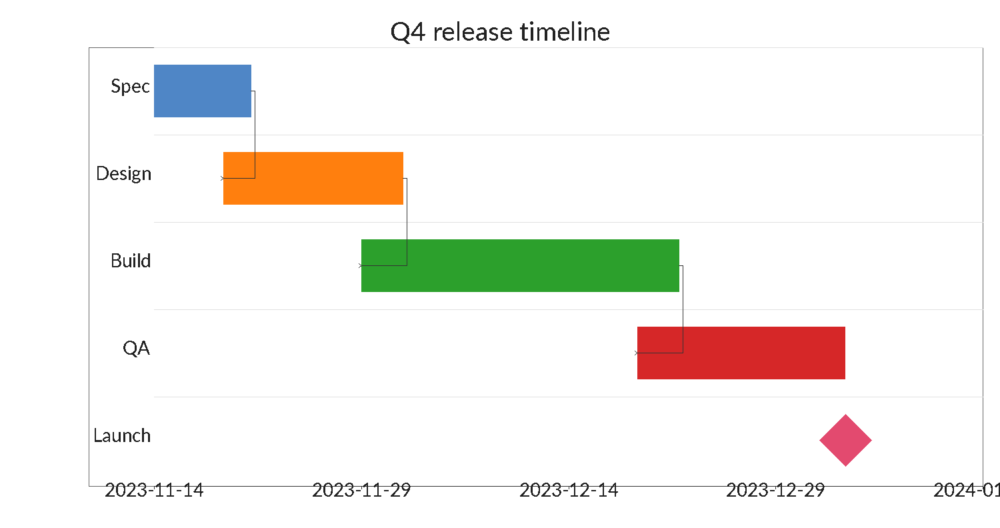

---

## 18. Stock with indicator panes

`addIndicatorPane` stacks a custom data strip below the price.
`setMovingAverages` is the bulk shortcut for several SMAs at once.
`setVolumeColors` overrides the per-bar volume color.
`setDateAxisStride` controls X-axis tick density.

```php
(new FastChart\StockChart(820, 520))
    ->setTitle('ACME with RSI indicator pane')
    ->setOhlcv($rows)
    ->setMovingAverages([10, 20, 50])
    ->setVolumePane(true)
    ->setVolumeColors(array_fill(0, 60, 0x9D9D9D))
    ->addIndicatorPane('RSI(14)', $rsi, ['color' => 0x9B5DE5])
    ->setDateAxisStride(FastChart\Chart::DATE_WEEK, 2)
    ->renderToFile('18_stock_indicators.png');
```

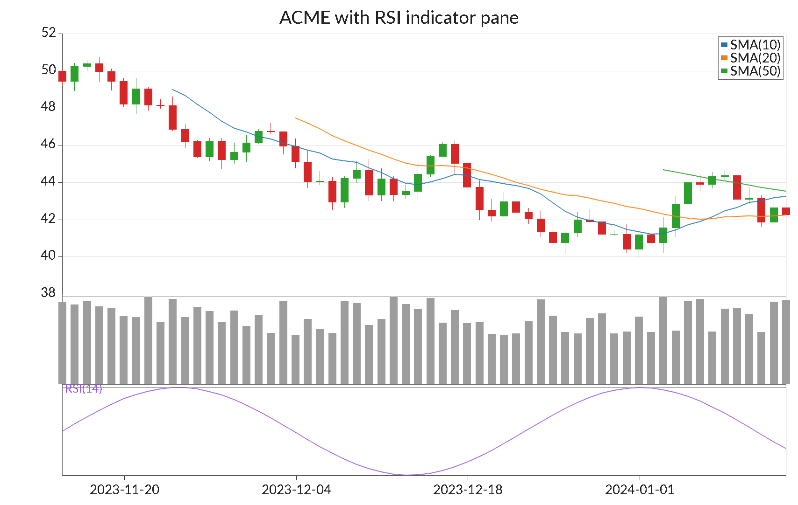

---

## 19. Error bars

Each `setErrorBars` entry is either a single positive scalar
(symmetric ±) or `[lo, hi]` (asymmetric). Works on `LineChart` and
`ScatterChart`.

```php
(new FastChart\LineChart(640, 360))
    ->setTitle('Measured signal with confidence interval')
    ->setSeries([['data' => [12.3, 14.1, 13.5, 15.8, 17.2, 18.9, 20.1, 19.4]]])
    ->setErrorBars([0.8, 0.7, 1.2, 0.9, [0.5, 1.5], 1.0, 0.6, 1.1])
    ->renderToFile('19a_line_errors.png');
```

| Line errors | Scatter (asymmetric) |
|---|---|
| 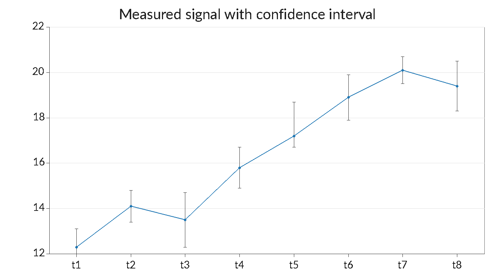 | 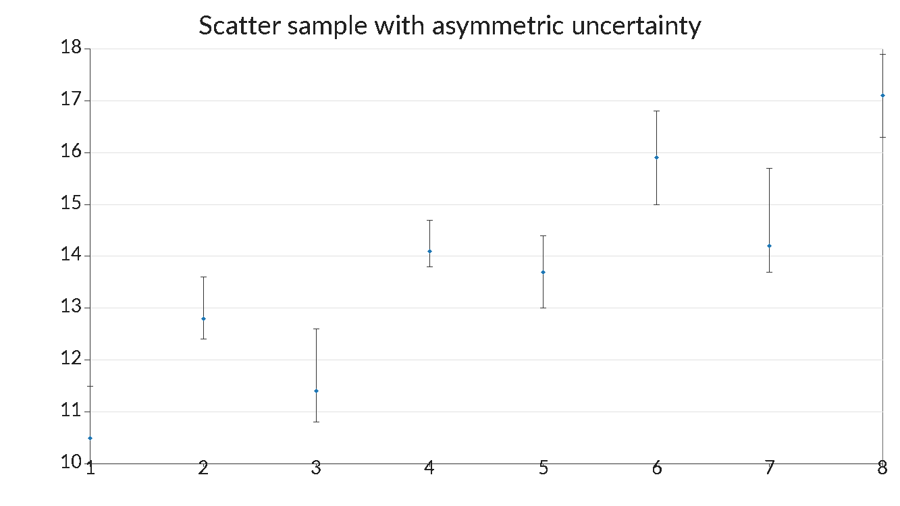 |

---

## 20. Output formats

Every way to get pixels out of a chart:

```php
$line = (new FastChart\LineChart(400, 200))
    ->setTitle('Output formats demo')
    ->setSeries([['data' => [10, 20, 15, 25, 22, 30]]]);

$line->renderToFile('out.png');           // file, format from extension
$line->renderToFile('out.svg');           // SVG goes through the same call
$png  = $line->renderPng();               // PNG bytes
$jpg  = $line->renderJpeg(85);            // JPEG bytes (quality 1..100; default 88 via setJpegQuality)
$webp = $line->renderWebp(80);            // WebP bytes (quality 1..100)
$svg  = $line->renderSvg();               // SVG document (vector)
$frag = $line->drawSvgFragment();         // <g class="fastchart">…</g>
```

The bytes-returning helpers skip the encode-to-disk roundtrip and are
convenient for HTTP responses, base64 data URIs, or hashing. SVG
defaults to glyph-path output (`SVG_TEXT_PATHS`) — every text element
is flattened to `<path>` data via FreeType so the SVG renders
identically in any rasterizer. Switch to native `<text>` for smaller,
selectable output via `setSvgTextMode(FastChart\Chart::SVG_TEXT_NATIVE)`.

GIF and AVIF were dropped in v1.0; their `render*` methods raise
`\Error`. `draw($canvas)` is also gone — fastchart owns the pixel
buffer end-to-end through plutovg. For compositing several charts
onto one image, stitch SVG fragments via `drawSvgFragment()` or
composite the bytes returned by `renderPng()` in userland.

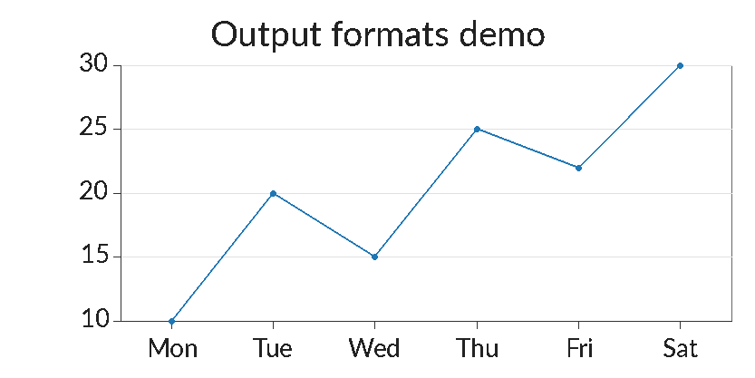

---

## 22. Axis customization

Every axis-tuning knob: log scale, fixed range, rotated labels, label
stride, tick mode, format strings, axis visibility, zero shelf.

```php
(new FastChart\LineChart(720, 380))
    ->setTitle('Log-scale revenue with rotated date labels')
    ->setSeries([['data' => [120, 240, 480, 920, /* … */]]])
    ->setCategoryLabels(['2016','2017',/* … */])
    ->setYAxisScale(FastChart\Chart::SCALE_LOG)
    ->setYAxisLabelFormat('$%.0f')
    ->setXAxisLabelAngle(45)
    ->setXLabelStride(1)
    ->setTickMode(FastChart\Chart::TICK_BOTH)
    ->setZeroShelf(true)
    ->renderToFile('22a_axis_log.png');
```

| Log + rotated | Linear, axes hidden |
|---|---|
| 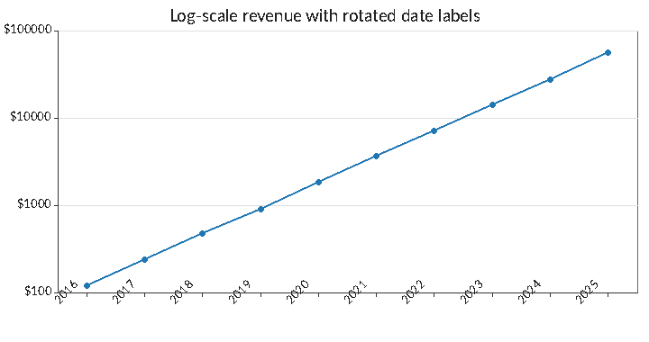 | 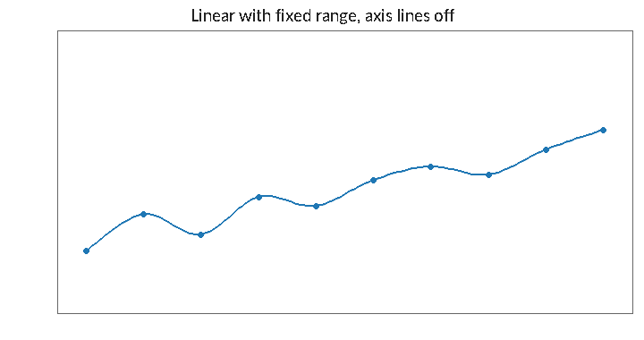 |

---

## 23. Custom styling: colors, borders, line style

Color knobs for every painted surface: chart background, plot
background, axis, grid, border, text, title, axis labels, axis
titles. Plus border-side bitmask, line dash style, and edge color
on filled shapes.

```php
(new FastChart\LineChart(720, 360))
    ->setTitle('Custom palette across every painted surface')
    ->setBackgroundColor(0x1A1F2C)
    ->setPlotBackgroundColor(0x232A3D)
    ->setAxisColor(0x6E7894)
    ->setGridColor(0x363D52)
    ->setBorderColor(0x6E7894)
    ->setBorderSides(FastChart\Chart::BORDER_LEFT | FastChart\Chart::BORDER_BOTTOM)
    ->setTextColor(0xC9D1E0)
    ->setTitleColor(0xFFD166)
    ->setAxisLabelColor(0xA0AAC4)
    ->setAxisTitleColor(0xC9D1E0)
    ->setLineStyle(FastChart\Chart::LINE_DASHED)
    ->setSeriesColors([0x06D6A0, 0xFFD166, 0xEF476F])
    ->setSeries([/* … */])
    ->renderToFile('23a_custom_palette.png');
```

| Custom palette | Narrow bars + transparent bg |
|---|---|
| 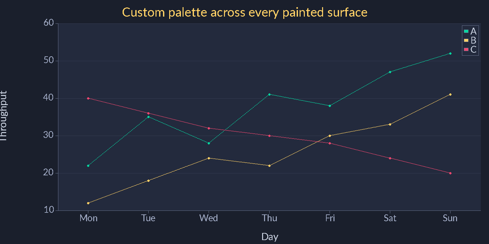 | 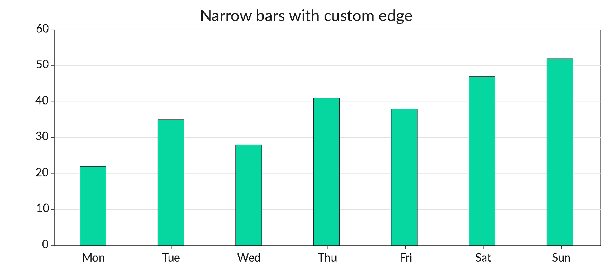 |

---

## 24. Fonts

Per-role TTF override. `setFontPath` + `setFontSize` set the global
default; `setTitleFont` / `setAxisFont` / `setLabelFont` override per
role. `setThumbnailMode(true)` suppresses labels and shrinks fonts
for tile-sized previews.

```php
(new FastChart\LineChart(640, 360))
    ->setTitle('Per-role font override')
    ->setFontPath('/usr/share/fonts/truetype/dejavu/DejaVuSans.ttf')
    ->setFontSize(11)
    ->setTitleFont('/usr/share/fonts/truetype/dejavu/DejaVuSans-Bold.ttf', 18)
    ->setLabelFont('/usr/share/fonts/truetype/dejavu/DejaVuSerif.ttf', 9)
    /* … */
    ->renderToFile('24a_font_override.png');
```

| Custom fonts | Thumbnail mode |
|---|---|
| 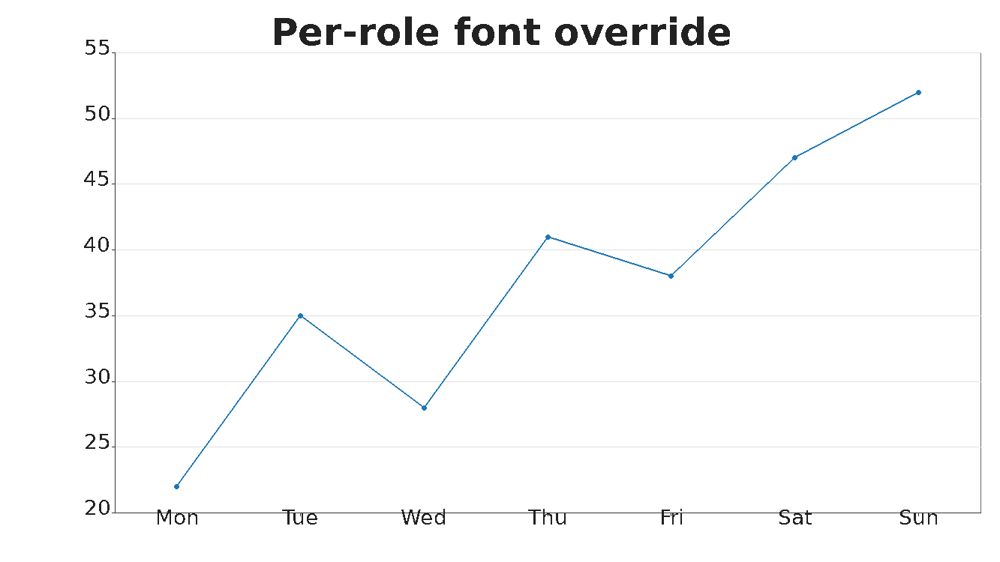 | 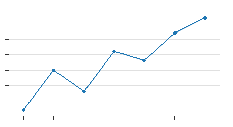 |

---

## 25. Overlays, text, icons

`addOverlaySeries` traces an extra polyline (or area) on top of the
chart. `addTextAnnotation` places free-floating text at chart
coordinates. `addIconAt` overlays an external image at a data point.

```php
(new FastChart\LineChart(720, 380))
    ->setTitle('Daily traffic with overlay + text + icon annotations')
    ->setSeries([['label' => 'Visitors', 'data' => [/* … */]]])
    ->addOverlaySeries('line', [/* baseline values */],
                       ['color' => 0x9D9D9D, 'thickness' => 1])
    ->addTextAnnotation('campaign launch', 3, 7000, 0xE34A6F)
    ->addIconAt(3, 5200, '/tmp/star.png', 20, 20)
    ->renderToFile('25_overlays_text_icons.png');
```

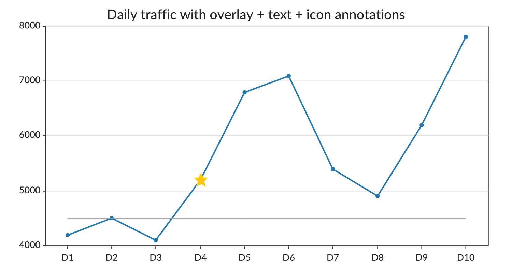

---

## 26. Stock candle styles

Same OHLCV data rendered in every candle style fastchart supports.

| STYLE_CANDLE | STYLE_BAR | STYLE_DIAMOND | STYLE_I_CAP |
|---|---|---|---|
| 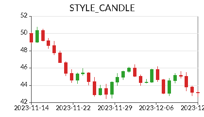 | 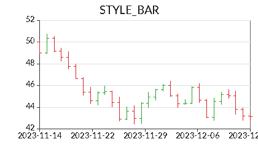 | 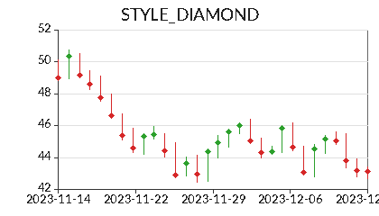 | 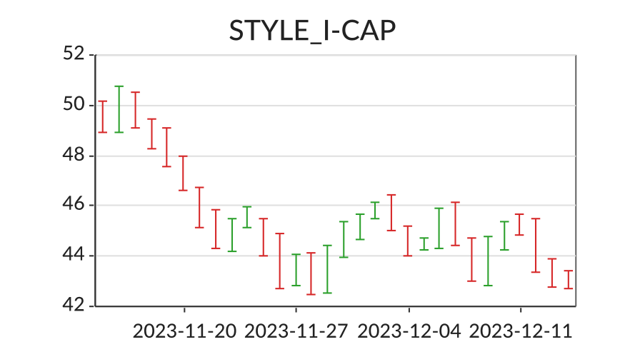 |

| STYLE_HOLLOW | STYLE_VOLUME | STYLE_VECTOR |
|---|---|---|
| 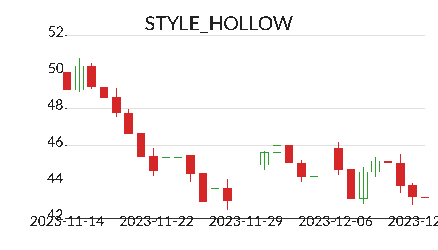 | 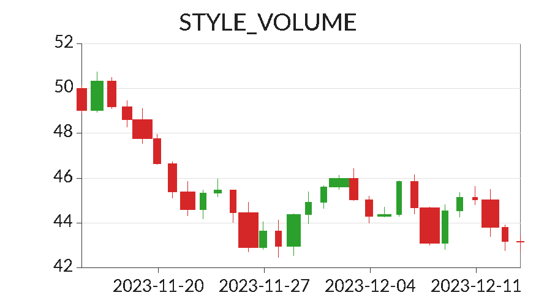 | 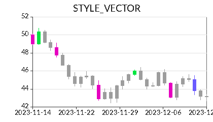 |

```php
(new FastChart\StockChart(420, 240))
    ->setOhlcv($rows)
    ->setCandleStyle(FastChart\Chart::STYLE_HOLLOW)  // or STYLE_BAR / DIAMOND / etc
    ->renderToFile('26e_hollow.png');
```

---

## 27. Area chart: stacked vs overlay

Stacked accumulates each series on top of the running total; overlay
draws each series at zero baseline with translucent fills controlled
by `setFillOpacity`.

| Stacked | Overlay |
|---|---|
| 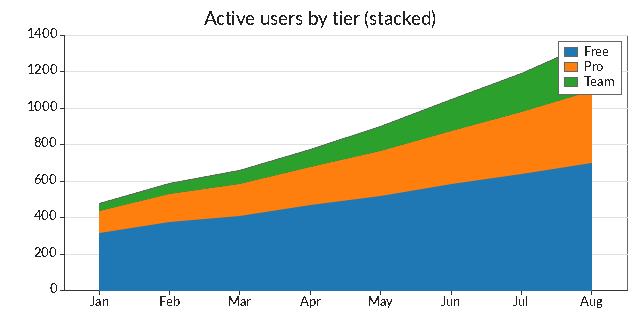 | 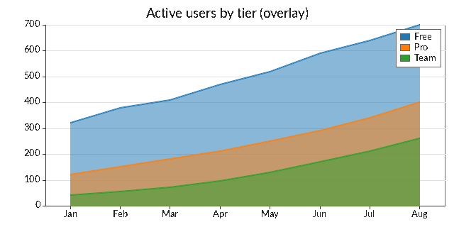 |

---

## 28. Bar variants: floating + layered stack

`setFloating(true)` interprets each entry as `[min, max]` and draws
bars between those bounds (Gantt-style). `setStackMode(STACK_LAYER)`
overlays translucent series at the same baseline instead of summing
them. **`setFloating` must be called before `setSeries`** so the
parser reads each entry as a tuple.

| Floating bars | Layered stack |
|---|---|
| 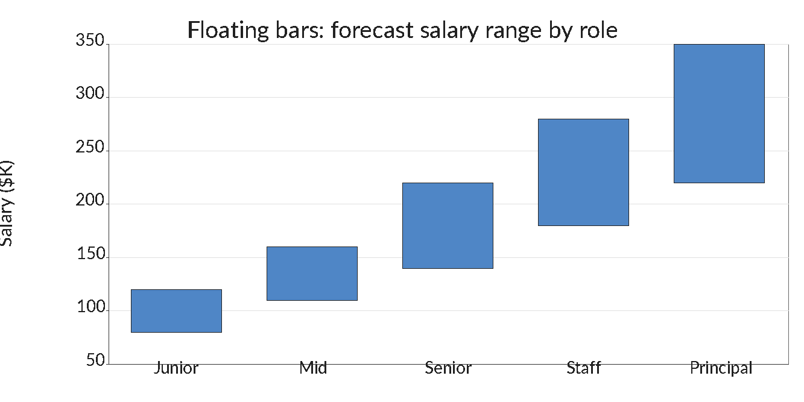 | 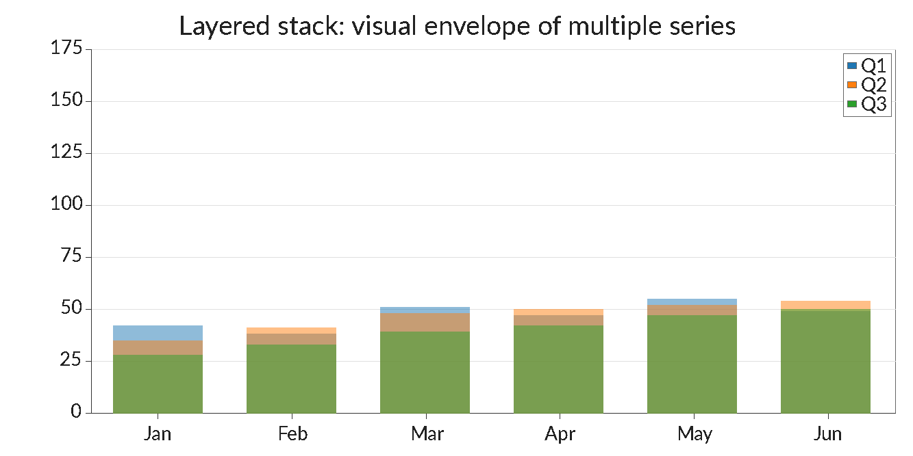 |

---

## 29. Pie aggregation

`setOtherThreshold(percent, label?)` rolls every slice below the
given percentage into a single `Other` slice. Useful for long-tail
breakdowns where dozens of < 1% slivers would crowd the legend.

| Without aggregation | With Other = 2% |
|---|---|
| 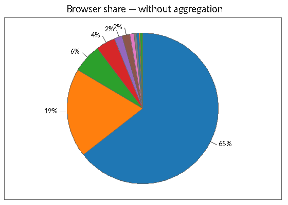 | 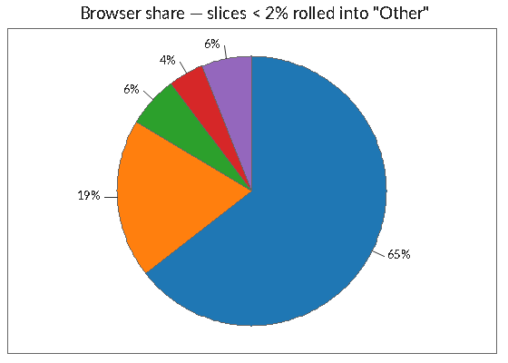 |

---

## 30. Image map for clickable charts

Scatter points carrying `'href'` (and optional `'tooltip'`) become
clickable; `getImageMap('mapname')` after any of the render*()
methods (or `renderToFile()`) emits the HTML `<map>`. Schemes
outside `http(s)://`, `mailto:`, fragment, and absolute path are
silently rejected. Attribute values are HTML-escaped.

```php
$chart = (new FastChart\ScatterChart(560, 360))
    ->setPoints([
        [1, 42, 'href' => '/dash?q=1&r=americas', 'tooltip' => 'Americas Q1'],
        [2, 51, 'href' => '/dash?q=2&r=americas', 'tooltip' => 'Americas Q2'],
        /* … */
    ]);
$chart->renderToFile('30_image_map.png');
$map = $chart->getImageMap('quarterly');
file_put_contents('chart.html', '' . $map);
```

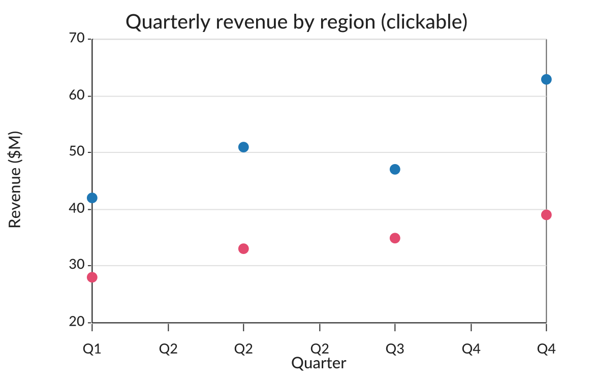

---

## 31. Misc utility setters

The remaining catch-all knobs:
- `FastChart\Chart::version()`: extension version (static)
- `setSize(w, h)`: change canvas size after construction
- `setPlotRect(x0, y0, x1, y1)`: pin the plot area to fixed pixel
  coordinates; useful for compositing two charts on one canvas
- `setStrict(true)`: TypeError on non-numeric Line/Area/Bar series
  cells instead of silent NaN coercion
- `setBoxWidth(percent)`: boxplot box width as a percent of slot
- `setBackgroundImage(path)`: bitmap behind the chart; PNG/JPEG only;
  open_basedir-checked at draw time

```php
/* Stitch two charts side-by-side into one SVG document via
 * drawSvgFragment(). v1.0 owns the canvas end-to-end — there's no
 * shared GdImage to composite onto — so multi-chart layouts are
 * built at the SVG layer and rasterized once if needed. */
$left = (new FastChart\LineChart(380, 320))
    ->setTitle('Left chart')->setSeries([/* … */])
    ->drawSvgFragment();
$right = (new FastChart\BarChart(380, 320))
    ->setTitle('Right chart')->setSeries([/* … */])
    ->drawSvgFragment();
$svg  = '<?xml version="1.0"?><svg xmlns="http://www.w3.org/2000/svg"'
      . ' width="800" height="320" viewBox="0 0 800 320">';
$svg .= '<g transform="translate(0,0)">'    . $left  . '</g>';
$svg .= '<g transform="translate(420,0)">'  . $right . '</g>';
$svg .= '</svg>';
file_put_contents('31b_two_charts.svg', $svg);
```

| setSize after construction | Two charts on one canvas | Background image |
|---|---|---|
| 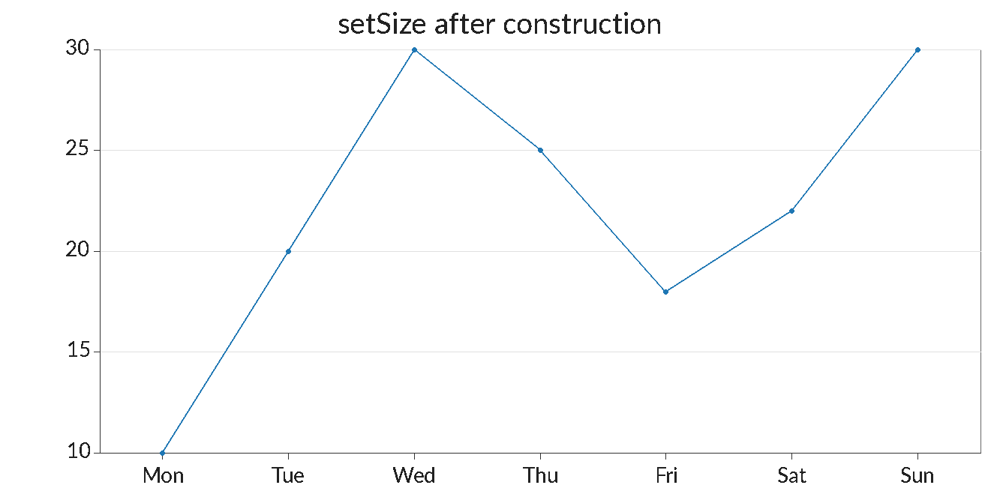 | 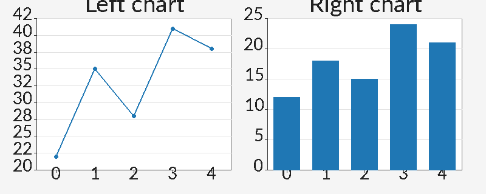 | 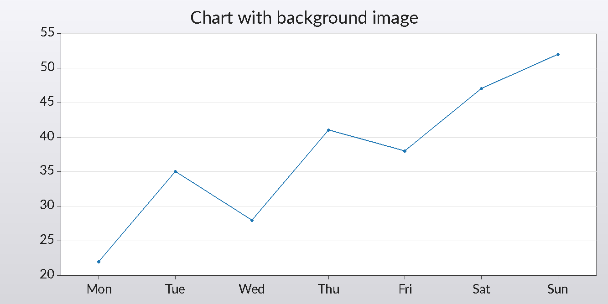 |

---

## 41. Code 128 barcode (1D)

`FastChart\Code128` ships a complete ISO/IEC 15417 encoder. Three
subsets (A: control + uppercase, B: full ASCII printable, C: digit
pairs) auto-switch within a single payload to minimise encoded
length; mod-103 checksum is appended automatically. `setShowText(true)`
renders the human-readable payload below the bars using the
auto-detected default font.

```php
(new FastChart\Code128())
    ->setData('FASTCHART-12345')
    ->setSize(400, 100)
    ->setShowText(true)
    ->renderToFile('41a_code128_alphanumeric.png');

(new FastChart\Code128())
    ->setData('0123456789012345')   // pure digits → subset C dense
    ->setSize(360, 80)
    ->setShowText(true)
    ->renderToFile('41b_code128_numeric.png');

(new FastChart\Code128())
    ->setData('FASTCHART-12345')
    ->setSize(400, 60)
    ->setShowText(false)             // bars-only compact form
    ->renderToFile('41c_code128_compact.png');
```

| Alphanumeric (B + tail-C) | Pure digits (subset C) | Compact (no text) |
|---|---|---|
|  | 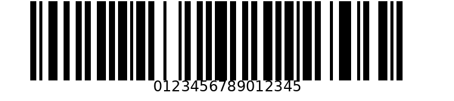 |  |

## 42. QR code (2D)

`FastChart\QrCode` wraps the vendored nayuki QR encoder
(`vendor/qrcodegen/`, MIT). Four error-correction levels: L (~7%
recovery), M (~15%, default), Q (~25%), H (~30%). Higher ECC eats
codeword space and may push the encoder up a version (more modules
per side, denser look), but the decoded payload survives more pixel
damage. Use H for QR codes physically printed on rough surfaces or
overlaid with a logo; L for QR codes embedded in clean digital
pipelines.

```php
$levels = [
    ['L', FastChart\QrCode::ECC_L, '42a_qrcode_ecc_l.png'],
    ['M', FastChart\QrCode::ECC_M, '42b_qrcode_ecc_m.png'],
    ['Q', FastChart\QrCode::ECC_Q, '42c_qrcode_ecc_q.png'],
    ['H', FastChart\QrCode::ECC_H, '42d_qrcode_ecc_h.png'],
];
foreach ($levels as [$label, $ecc, $file]) {
    (new FastChart\QrCode())
        ->setData('https://github.com/iliaal/fastchart')
        ->setSize(300, 300)
        ->setEcc($ecc)
        ->renderToFile($file);
}
```

| ECC_L (~7%) | ECC_M (~15%) | ECC_Q (~25%) | ECC_H (~30%) |
|---|---|---|---|
|  |  |  |  |

Symbol classes are render-only — there's no canvas-handoff entry.
Reload the encoded bytes via `imagecreatefromstring()` in userland if
you want to composite the symbol onto an existing image.

---

## Common patterns

- **`renderToFile($path)` is the simple path.** Format infers from the
  file extension (.png / .jpg / .jpeg / .webp / .svg). Use
  `renderPng()` / `renderJpeg($q)` / `renderWebp($q)` / `renderSvg()`
  when you need the raw bytes for HTTP, hashing, base64, or in-memory
  composition.
- **SVG text mode.** `setSvgTextMode(SVG_TEXT_PATHS)` (default) emits
  glyphs as `<path>` outlines so the SVG is self-contained.
  `SVG_TEXT_NATIVE` emits `<text>` elements — smaller files,
  selectable text, but requires the consumer's renderer to support
  SVG text.
- **JPEG quality.** `setJpegQuality(int)` sets a per-instance default
  (1..100, default 88) used by `renderJpeg()` with no args and
  `renderToFile('*.jpg')`. Per-call `renderJpeg(quality)` overrides.
- **Image maps.** Scatter points carrying `'href'` and optional
  `'tooltip'` become clickable; call `getImageMap('mapname')` after
  the render to emit the HTML `<map>`.
- **Strict numeric input.** `setStrict(true)` makes Line/Area/Bar
  `setSeries` throw `TypeError` on non-numeric cells. Other chart
  types parse best-effort.
- **Floating bars / setStrict / setFloating ordering.** A few setters
  must run **before** `setSeries` so the parser knows the input shape.
  `setFloating(true)` is the most common; without it, the parser
  expects scalars, not `[min, max]` tuples.

## See also

- [`examples/`](examples/): runnable PHP scripts for each chart above
- [`tests/`](../tests/): 96 phpt tests covering every public method
- [`fastchart.stub.php`](../fastchart.stub.php): full public API
  surface with docstrings
